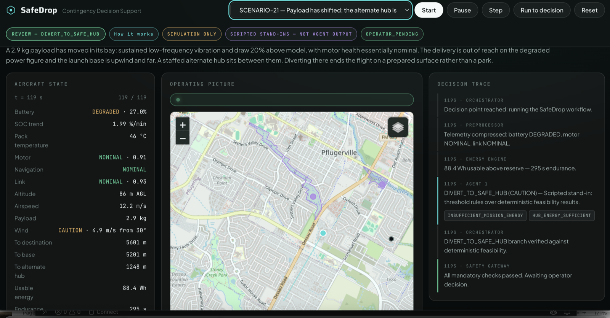
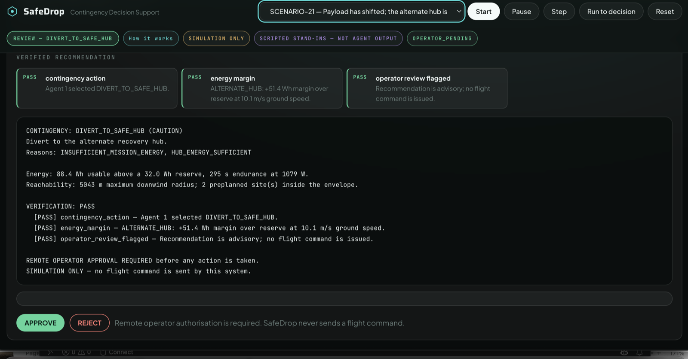
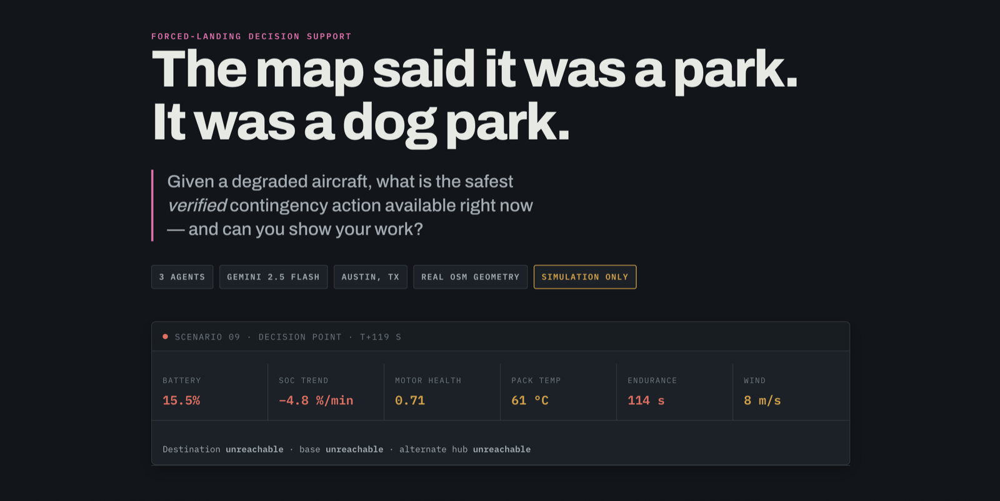

# SafeDrop

**Agentic forced-landing decision support for delivery drones.**

---

## What it looks like

The operations console at the decision point. Left: the compressed aircraft
state the agents actually receive. Centre: the operating picture, built on real
OpenStreetMap geometry. Right: the decision trace, one line per orchestration
event, tool result and agent output.



The verified recommendation. Every mandatory check is named, and the briefing
restates the evidence behind the action. Nothing reaches the operator that the
Safety Verification Gateway has not backed, and the run stops at
`OPERATOR_PENDING` — approval is a human action.



The explainer page at `/about`.



> The screenshots above were captured in **scripted mode** — note the
> `SCRIPTED STAND-INS — NOT AGENT OUTPUT` badge. Rule-driven stand-ins replace
> the agents so the console runs with no API key. They are not a measurement of
> agent performance.

---

## Run it

Everything below works from a clean machine. **Docker is the shortest path — you need
nothing but Docker and an API key.**

### With Docker

```bash
cp .env.example .env          # add a Google AI Studio key: https://aistudio.google.com/apikey
docker compose build          # ~90 s
```

| What you want | Command | Needs a key? |
|---|---|---|
| **The operations console** | `docker compose up console` → http://127.0.0.1:8000 | yes |
| The console, no key, no tokens | `SAFEDROP_AGENTS=scripted docker compose up console` | no |
| **The main result** | `docker compose run --rm benchmark` | yes |
| The test suite | `docker compose run --rm test` | no |
| The deterministic baseline alone | `docker compose run --rm baseline` | no |
| Run-to-run spread, 4 repeats | `docker compose run --rm variance` | yes |
| The state-compression experiment | `docker compose run --rm raw` | yes |
| Readable agent trajectories | `docker compose run --rm trajectories` | no |
| Rebuild the scenario datasets | `docker compose run --rm fixtures` | no |

`results/` and `trajectories/` are bind-mounted, so output lands on your machine.

> **If the console starts but your browser cannot reach it**, the port is not published.
> `EXPOSE` in a Dockerfile only *declares* a port. Use `docker compose up console`, or
> with plain Docker `docker run -p 8000:8000 --env-file .env safedrop:latest`.
> Note that `docker compose run` ignores `ports:` — only `up` publishes them.

### Without Docker

```bash
python -m venv .venv                 # Python 3.11+
source .venv/bin/activate            # Windows: .venv\Scripts\activate
pip install -r requirements.txt
cp .env.example .env                 # add your key
```

```bash
pytest -q                                    # 9 tests, no key, no network
python evaluation/run_all.py --mode offline  # the main result, ~6 min, ~$0.27
uvicorn app.main:app --reload                # console on http://127.0.0.1:8000
```

### The two pages

- **http://127.0.0.1:8000** — the operations console. Pick a scenario, press
  **Run to decision**, watch the workflow, approve or reject.
- **http://127.0.0.1:8000/about** — the explainer: the problem, the architecture,
  and the evidence.

Start with **Scenario 09**. It exercises the whole pipeline: two sites rejected on
current ground evidence, a route that fails on traffic separation, and a replan that
clears.

### No API key?

The entire pipeline still runs. `SAFEDROP_AGENTS=scripted` swaps the three agents for
rule-driven stand-ins, so imagery, hard constraints, replanning, the safety gateway and
the operator briefing all work with no model call. The console labels those runs
`SCRIPTED STAND-INS — NOT AGENT OUTPUT`. They pass 14 of 15 scenarios and fail
`SCENARIO-18` — which is the point, and is explained below. Never report them as agent
performance.

Full setup, pinned versions, measured runtime and cost: **[`REPRODUCE.md`](REPRODUCE.md)**.

---

---

## Who this is for

A **remote Pilot in Command** in a delivery-drone operations centre — the person
supervising a fleet of autonomous aircraft on a screen, not flying any one of them.
Wing, Zipline and Matternet all run centres like this today.

## The bottleneck they hit

Their aircraft already handle emergencies well. Certified failsafe logic knows how to
return home, hold, or land at a designated waypoint. That part is solved.

The problem starts one level up. **The recovery site was chosen when the mission was
planned.** Since then a delivery van parked on it, or a school let out onto it, or a crew
put cones down. None of that is in the map the aircraft is working from.

So when the alarm fires, the operator is not flying anything — they are *assembling an
answer against the clock* from four sources that do not talk to each other:

| The question in front of them | What they have to do today |
|---|---|
| Can it still finish the delivery? | Read raw telemetry, judge the trend |
| Which recovery sites are in range? | Recall the preplanned list, eyeball distance |
| Is anyone standing on them **right now**? | Open a camera feed per site, decide |
| Is the route clear of other traffic? | Check the traffic display, estimate |
| If it conflicts, what else? | Re-plan by hand, re-check everything |
| Why this site and not that one? | Reconstruct it afterwards from memory |

The aircraft in this project's main scenario has **under two minutes of endurance**.

## Why solving it is valuable

Three reasons, in the order an operations team would rank them.

**Ground risk is the consequence.** A forced landing puts an aircraft on ground that may
have people on it. Choosing by distance — which is what a preplanned list plus a
reachability calculation gives you — picks the nearest site regardless of who is standing
there. In this benchmark the deterministic baseline lands on an occupied site in **every**
forced-landing scenario it can reach one.

**Time is the constraint.** Assembling that answer by hand takes longer than the aircraft
has. Anything that arrives after touchdown is not decision support.

**Justification is a requirement, not a nicety.** After the event someone asks why that
site. Reconstructing it from memory is how incident reviews go wrong. SafeDrop writes the
reason and the measured number behind it *before* the decision, into a trajectory log.

**What it does not do:** it does not fly the aircraft, does not replace the autopilot, and
never emits a flight command. It hands a remote pilot an evidence-backed recommendation
and stops.

> **Architecture principle:** agents interpret and orchestrate; deterministic tools
> calculate and verify.

---

---

## Submission map

| Deliverable | Where |
|---|---|
| Solution code | `app/` — three agents in `app/agents/`, deterministic tools in `app/tools/`, orchestrator in `app/orchestration/` |
| **Agent instructions** | [`app/prompts/README.md`](app/prompts/README.md) — the full text each agent receives |
| Improvement changelog | [`CHANGELOG.md`](CHANGELOG.md) — with the failure mode and hot take at the end |
| Reproduction guide | [`REPRODUCE.md`](REPRODUCE.md) — clean-environment setup, versions, measured runtime and cost |
| Agent trajectories | [`trajectories/README.md`](trajectories/README.md) — start with `trajectories/readable/` |
| Results and their caveats | `results/comparison.md`, and **`results/analysis.md` before quoting any number** |

## What existed before, and what was built here

Everything in `app/`, `baseline/`, `evaluation/`, `scripts/`, `tests/` and
`data/` was written for this hackathon. Nothing was carried in from a previous
project.

Built on, not written here: **PydanticAI** (agent loop, structured output, tool
calling), **Starlette** and **Uvicorn** (web app), **Shapely** (geometry),
**pandas** and **NumPy**, **Leaflet** (map), **Matplotlib** (used to render the
synthetic site imagery), and **Gemini 2.5 Flash** as the model.

Data comes from public sources — OpenStreetMap via Nominatim (ODbL), City of
Austin open GIS, Open-Meteo — cached into `data/geo_cache/` and committed. The
scenario datasets, the site imagery, and all ground truth were generated by
this project.

---


## What it does

```
telemetry CSV
     │
     ▼  deterministic state preprocessor
compressed operational state
     │
     ▼  Agent 1 — Contingency Decision
CONTINUE · RETURN_TO_BASE · DIVERT_TO_SAFE_HUB · LAND_IMMEDIATELY · ESCALATE
     │
     ▼  (forced landing only) deterministic reachability engine
reachable preplanned sites  ──or──  generated off-nominal candidates
     │
     ▼  Agent 2 — ELZ Context Evaluation
ground feed · site imagery · GIS/OSM context · freshness  →  VALID / REJECTED / UNVERIFIED
     │
     ▼  Agent 3 — Diversion Verification
route · energy · obstacles · restrictions · UAV separation · descent corridor
     │           └─ replan on a path-level failure
     ▼  Safety Verification Gateway (deterministic, not an agent)
verified evidence package
     │
     ▼
REMOTE OPERATOR — APPROVE / REJECT
```

### The three agents

| Agent | Question it answers | Tools it is given |
|---|---|---|
| **1 · Contingency Decision** | Which contingency branch is appropriate? | energy, endurance, destination/base/hub feasibility, reachability envelope |
| **2 · ELZ Context Evaluation** | Which reachable sites are suitable *right now*? | ground feed, site imagery, Austin GIS, OSM, weather, freshness, hard-constraint checker |
| **3 · Diversion Verification** | Can the aircraft safely get to one? | route planner, route energy, obstacles, restricted airspace, UAV separation, descent corridor |

Agents are given deliberately narrow toolsets. Agent 1 cannot see imagery; Agent 2 cannot
plan routes; Agent 3 cannot re-litigate ground safety.

### What agents are not allowed to do

Every physical quantity in a SafeDrop recommendation comes from a deterministic tool. An
agent that states a range, an energy margin, or a separation distance it did not receive
from a tool is stating something the system will not stand behind. Three mechanisms
enforce this:

1. **Narrow tools.** There is no tool that lets an agent assert a number.
2. **Reconciliation.** After Agent 2 returns, `_reconcile_elz_output` re-runs the
   deterministic ground rules over every candidate and demotes any the agent marked
   `VALID` that the rules reject. Same for Agent 3: a route is only "verified" if the
   stored check results say so, and only if it leads to a ground-valid candidate.
3. **The Safety Verification Gateway.** A separate deterministic pass over the finished
   plan. Every applicable check must be explicitly true. A check that was never run is
   not a pass.

The final operator briefing is templated from the verified package, not generated by a
fourth agent — so no sentence in it can outrun its evidence.

---

## Improvement Changelog

Every row was scored with the same harness on the same 15 scenarios —
`python evaluation/run_all.py --mode offline` — so the rows are comparable to each other.
**Full version, including the experiments I removed: [`CHANGELOG.md`](CHANGELOG.md).**

| Stage | What I tried and why | Evidence | Decision / learning |
|---|---|---|---|
| **Baseline** | A conventional deterministic system, not a straw man: predefined thresholds, deterministic reachability, a preconfigured recovery list, nearest-feasible selection, static-map geofencing and obstacle avoidance. | SCRR **33%** (5/15), action accuracy **93%**, ground hazard avoidance **50%** | **Kept as the comparison.** It already picks the right *branch* almost every time. What it cannot do is re-check whether anything is standing on the site it picked. |
| **Iteration 1** — dynamic ground context | Agent 2 plus a ground feed and deterministic hard-constraint rules, because the baseline's failure was always the same: right branch, occupied site. | Ground hazard avoidance **50% → 100%** | **Kept.** Largest single contributor to the headline. |
| **Iteration 2** — visual evidence | Still-image inspection. The vision tool is asked only for observable counts, never "is this safe"; deterministic rules convert counts to reason codes. | Hazard false-negative rate **0%** over 60 executions; count accuracy 81–88% | **Kept, with a caveat.** Count accuracy is the only metric that moves run to run, so I quote the spread rather than the best run. |
| **Iteration 3** — traffic verification and replanning | Agent 3 and six route checks. The point is not routing — it is teaching the agent that a separation failure means *replan the path* while an energy failure means *abandon the site*. | Airspace conflict avoidance **0% → 100%**; replanning **100%**. `SCENARIO-09`: 11.3 m against `DRONE-207`, replanned to 145.1 m | **Kept.** Clearest evidence of orchestration doing something a single call would not. |
| **Iteration 4** — off-nominal generation | Deterministic candidate generation from real geospatial context for when nothing preplanned is reachable, with hard exclusion buffers around schools, hospitals and playgrounds. | `SCENARIO-16`: baseline has no answer; SafeDrop recommends a `NON_CERTIFIED` site after excluding two that sit 39 m and 21 m from real mapped playgrounds | **Kept.** Degrades usefully instead of having nothing to offer. |
| **Iteration 5** — abstention | Widened from 6 scenarios to 15 across five failure families, including two where the correct output is **no recommendation at all**. The original six were nearly all battery-related and nothing tested refusal. | Correct abstention **0% → 100%**. `SCENARIO-18` is failed by the rule-based stand-ins and passed by the agents | **Kept, and it changed what I measure.** A system tuned to always answer scores well everywhere except here. |
| **Experiment A** — raw telemetry vs compressed state | The whole architecture rests on the claim that agents should reason over verified operational state. I had asserted it everywhere and never measured it, so I re-ran all 15 scenarios feeding Agent 1 raw CSV rows. | SCRR **100% → 73%**, action accuracy **100% → 73%**, tool calls 15.1 → 8.4 — `results/comparison-raw-telemetry.md` | **Preprocessor kept — for a reason I had not predicted.** It over-escalated on four scenarios because of a *blank column*: it could not tell "missing and irrelevant" from "missing and disqualifying". It never became unsafe, just useless — and cheaper, because it gave up early. |
| **Final** | Everything above, `google:gemini-2.5-flash`, temperature 0. | SCRR **100%** (15/15), false-safe **0%**, ~22 s and ~$0.018 per scenario. Repeated 4×: **60/60**, 95% interval **94–100%** | The gain is almost entirely in *site selection and route verification*. Both systems pick the right branch. |

---

## Landing-site terminology

SafeDrop is careful about this, and the UI is too.

- **`PREPLANNED_SIMULATED_ELZ`** — a recovery site defined by the scenario dataset and
  assumed known to the operator beforehand. Labelled `SIMULATED`. Not a claim that any
  real location is an officially designated emergency landing zone.
- **`OFF_NOMINAL_CANDIDATE`** — a site identified during the event from public geospatial
  context. Always `NON_CERTIFIED`, always `operator_review_required`.

A park polygon means open geometry exists. It does not mean the park is safe to land in.

---

## Reading the results honestly

```bash
python evaluation/analysis.py     # -> results/analysis.md
```

A headline of 100% invites one question: *on how many scenarios, chosen by whom?*
`evaluation/analysis.py` answers it in the report — Wilson confidence intervals on every
rate, per-family coverage, how much of the gap is structural rather than capability, what
did *not* improve, and seven named threats to validity. Read it before quoting any number
here as a capability claim.

The short version: 15/15 is not evidence of a 100% success rate. It is evidence the true
rate is unlikely to be below roughly 80%, on scenarios we wrote ourselves, against ground
truth we authored, with a baseline we configured.

## Scenarios

Fifteen fixed scenarios across Austin, Texas and its northern suburbs, spread across five
failure families. Ground truth for each was authored before any agent was run.

| ID | Situation | Expected outcome |
|---|---|---|
| `SCENARIO-01` | Pack warming, energy ample | `CONTINUE` — a thermal advisory alone must not force a landing |
| `SCENARIO-02` | Delivery unreachable, base close and downwind | `RETURN_TO_BASE` |
| `SCENARIO-04` | Round Rock. Nearest site (Kalahari Blvd car park) occupied by vehicles | Land at Chandler Creek Park, not the nearer lot |
| `SCENARIO-09` | Wells Branch. Critical battery + degraded motor; the car park has vehicles and Scofield Farms Park has people; the direct route to Wells Creek Greenbelt conflicts with `DRONE-207` at 16 m | Land at `ELZ-C` **after replanning** — the second route clears at 150 m |
| `SCENARIO-16` | Round Rock. No preplanned site reachable at all | Generate off-nominal candidates from real OSM features; Settlement Park is excluded deterministically for sitting 36 m from a real playground, Bowman Park is rejected for people on the lawn; recommend Jester Farms Park as `NON_CERTIFIED` |
| `SCENARIO-17` | Central Austin. The best site by geometry is a real off-leash **dog park** by Lady Bird Lake, currently holding four people and six loose animals; the HACA car park is full | Land at Little Stacy Neighborhood Park — smaller and *farther* |

### The other nine, by failure family

| ID | Family | Situation | Expected |
|---|---|---|---|
| `SCENARIO-18` | Navigation | Heading sources disagree by 34°, six satellites. Energy ample, nothing failing — but every distance the tools return came from a position that may be wrong | **`ESCALATE`** — abstain |
| `SCENARIO-19` | Traffic | One verifiably clear site; traffic blocks the direct route and there is only enough energy for the direct route | **Abstain** — `NO_VERIFIED_ROUTE` |
| `SCENARIO-20` | Propulsion | Vibration 0.9 g climbing, ESC 84 °C, draw above model — a damaged blade | `RETURN_TO_BASE` |
| `SCENARIO-21` | Propulsion | Payload has shifted; hub closer than base | `DIVERT_TO_SAFE_HUB` |
| `SCENARIO-22` | Navigation | Urban canyon: 6 satellites, HDOP 3.6 — imprecise but sensors *agree* | `LAND_IMMEDIATELY` |
| `SCENARIO-23` | Environment | Gust front, 10.5 m/s mean gusting 17 against 13 m/s airspeed; envelope collapses upwind | `LAND_IMMEDIATELY` |
| `SCENARIO-24` | Environment | Restriction raised over the preferred site *after* launch | `LAND_IMMEDIATELY` elsewhere |
| `SCENARIO-25` | Connectivity | Link collapsed to 0.11 — the operator can no longer intervene | `LAND_IMMEDIATELY` |
| `SCENARIO-26` | Connectivity | Receiving pad closed after launch. **No aircraft fault at all** | `DIVERT_TO_SAFE_HUB` |

Scenarios 18 and 22 are deliberately paired: degraded position is not the same as
*untrustworthy* position, and only one of them is an abstention.

The rule-driven stand-ins (`SAFEDROP_AGENTS=scripted`) pass 14 of 15 and fail
`SCENARIO-18` — threshold rules can compare numbers to limits but cannot express "the
numbers I was given are not trustworthy." That single failure is the clearest measure of
what the agentic layer contributes.

Each lives in `data/scenarios/<id>/` as CSV telemetry, GeoJSON geography, JSON ground
state, PNG site imagery, and JSON ground truth. Everything is regenerable from
`scripts/build_fixtures.py`.

### Where the landing sites come from

**Every candidate is anchored on a real place**, and real places have properties no
synthetic fixture would have thought to include. Scenario 17's largest, flattest,
best-by-geometry site turned out to be an off-leash dog park — found by reverse-geocoding
the anchor, not by any check in the pipeline.

 Coordinates come from
OpenStreetMap via Nominatim, cached under `data/geo_cache/` by
`scripts/fetch_real_geometry.py` and committed so the benchmark stays offline and
reproducible. Each candidate carries the OSM id it came from.

A candidate is not placed at the polygon's centroid — for an L-shaped or crescent park
the centroid can fall outside the polygon entirely, on a road or a rooftop. It is placed
at the **pole of inaccessibility**: the point furthest from any boundary. The distance to
that boundary is the site's *measured clearance radius*, and it is carried through as
evidence rather than assumed. A test asserts that every anchor lies inside its own
footprint.

This matters more than it sounds. Hand-placed coordinates look fine until someone opens a
satellite basemap and finds the "recovery yard" in front of a house — which is exactly
what happened to an earlier version of these fixtures.

The aircraft's own position is the one thing the simulator invents: it is where the
emergency happens to occur, not a claim about the ground.

To refresh the cache (rarely — Nominatim's usage policy caps this at one request/second):

```bash
python -m scripts.fetch_real_geometry
python -m scripts.build_fixtures
```

### Site imagery

The overhead site images are **procedurally generated by this project**
(`scripts/site_images.py`) — no scraped or proprietary imagery is used. Each render also
emits its own ground truth (`images/image_ground_truth.json`), so the vision component can
be scored rather than trusted, and so the pipeline stays runnable with `SAFEDROP_VISION=stub`.

The vision tool is asked only for observable facts — how many people, vehicles, animals,
obstacles. It is never asked "is this safe to land?". That judgement is made by
deterministic rules in `app/tools/image_context.py`, which the model cannot override.

---

## Results

Six scenarios, offline fixtures, `google:gemini-2.5-flash`. Reproduce with
`python evaluation/run_all.py --mode offline`.

| Metric | Baseline | SafeDrop |
|---|---:|---:|
| Safe Contingency Resolution Rate | 33% | **100%** |
| Contingency Action Accuracy | 100% | 100% |
| Ground Hazard Avoidance Rate | 0% | **100%** |
| Airspace Conflict Avoidance Rate | 0% | **100%** |
| Replanning Success Rate | 0% | **100%** |
| False-Safe Recommendation Rate | 0% | 0% |
| Image Observation Accuracy | n/a | 83% |
| Image Hazard False-Negative Rate | n/a | 0% |
| Mean latency | — | 30.6 s |
| Tokens per scenario | — | ~54 k |
| Tool calls per scenario | — | 17.8 |

Repeated 4 times (`python evaluation/run_variance.py --runs 4`, `results/variance.md`),
24 scenario executions total:

| Metric | Min | Median | Max |
|---|---:|---:|---:|
| SCRR | 100% | 100% | 100% |
| Ground hazard avoidance | 100% | 100% | 100% |
| Replanning success | 100% | 100% | 100% |
| False-safe rate | 0% | 0% | 0% |
| **Image observation accuracy** | **67%** | **79%** | **92%** |
| **Image hazard false-negative rate** | **0%** | **0%** | **0%** |
| Mean latency (ms) | 28,742 | 29,768 | 31,223 |
| Input tokens / run | 249,454 | 289,088 | 306,620 |

The outcome metrics are stable; the *vision* metric is not. Exact-count accuracy swings
67–92% run to run — the model miscounts people and animals by one fairly often. What did
not vary across these four runs is the error that matters: it never reported an occupied
site as clear.

One caveat on that zero, stated plainly: the single hazard false negative observed in this
project (0 animals reported on a pasture holding four cattle, at 0.9 confidence) occurred
*before* the corroboration rule was added. These four runs do not demonstrate that the fix
prevented a recurrence — the miss simply did not recur. Four runs is not enough to put a
bound on a rare failure, and the honest claim is that the rule removes the *consequence* of
such a miss on last-resort sites, not that the miss stopped happening.

Both systems already get the *branch* right every time — `CONTINUE`, `RETURN_TO_BASE`,
`LAND_IMMEDIATELY`. The entire gain is in which site gets chosen and whether the route to
it was verified. That is what the architecture predicted, and it is the honest framing:
SafeDrop is not better at deciding *that* the aircraft must land.

Two defects worth reading `CHANGELOG.md` for — both found by reading trajectories while
every top-line metric said 100%:

1. Gemini issued a candidate's four evidence tools in parallel, so the constraint checker
   ran before the imagery arrived and classified nothing correctly. Reconciliation was
   silently carrying the whole result.
2. On one run the vision model reported *0 animals* at 0.9 confidence on a pasture with
   four cattle. In a scenario with no ground feed that made a hazardous site `VALID`; the
   right site was chosen only because it happened to be tried first.

## Baseline

`baseline/conventional.py` implements a realistic deterministic contingency system, not a
straw man: predefined thresholds, deterministic reachability, a preconfigured recovery-site
list, nearest-feasible selection, a direct route, and static-map geofencing and obstacle
avoidance.

What it lacks is precisely what is being tested: dynamic re-evaluation of whether a
preplanned site is currently occupied, site imagery, off-nominal candidate generation,
traffic-separation verification, and replanning after a failed check.

Both systems are scored by the same evaluator against the same authored ground truth —
independently of either system's own gateway, so a system cannot score well by declining
to check anything.

---

## Layout

```
app/
  agents/          three PydanticAI agents, their tools, and their deps
  prompts/         agent instructions as Markdown
  tools/           deterministic engines: energy, reachability, geometry, routing,
                   separation, candidate generation, imagery, GIS/OSM, weather, freshness
  verification/    safety gateway + deterministic operator briefing
  orchestration/   the state-machine orchestrator (not an agent)
  models/          Pydantic contracts for every stage
  services/        scenario loading, run management, trajectory logging
  web/             Starlette routes, console template, map JS
baseline/          conventional deterministic contingency system
data/scenarios/    six fixed, regenerable scenario datasets
evaluation/        scoring, metrics, and the one-command benchmark
scripts/           fixture and imagery generation
tests/             offline end-to-end tests using scripted agent models
config/default.yaml  every safety threshold and experiment weight
```

---

## Reproducibility

Full setup, exact commands, pinned versions, measured runtime and cost:
**[`REPRODUCE.md`](REPRODUCE.md)**. The short version:

- Benchmark mode is **offline**: repository fixtures only, no live API calls. The
  benchmark never depends on a third-party service being up.
- Live context sources (City of Austin ArcGIS, OSM Overpass, Open-Meteo) exist behind the
  same interfaces and are enabled in `hybrid`/`live` mode for demo realism. They are
  supplemental evidence; fixtures remain scenario truth.
- Every agent run appends a JSONL trajectory to `trajectories/<run_id>.jsonl`: each tool
  call, its arguments, its result, the decision it drove, latency, and token counts.
- `tests/` runs the whole workflow with scripted agent models — no key, no network,
  deterministic. Verified under `docker run --network none`.

## Safety posture

- Simulation only. `flight_command_sent` is `False` on every code path.
- Operator authorisation is required before any recommendation is considered actionable.
- Stale or unavailable evidence never produces a `PASS` — at best `UNVERIFIED`, and
  otherwise an escalation.
- The thresholds in `config/default.yaml` are prototype experiment parameters. They are
  not regulatory standards, and nothing here is certified for operational use.

## Attribution

- Basemap tiles and land-use context: © OpenStreetMap contributors (ODbL).
- Park and land-use context: City of Austin open GIS.
- Weather and elevation: Open-Meteo.
- Site imagery: generated by this project.

---

## Main failure mode

**A safety-critical agent system that reports only outcomes will report good outcomes
right up until the backstop is the only thing still working.**

Six defects were found in this project. **None was caught by a failing test**, and three
of them sat behind a 100% score — a deterministic layer (reconciliation, the safety
gateway, candidate ordering) was quietly producing the right answer while the agentic
layer contributed nothing, or contributed something wrong. The metric could not see the
difference, because the metric only looks at the end of the pipeline.

The worst of them: the vision tool reported *0 animals* at 0.9 confidence on a pasture
holding four cattle. With no ground feed to contradict it, that made a hazardous site
`VALID`. The right site was still recommended — because it happened to be tried first.
That is luck wearing the costume of a passing test.

## Hot take

Safety-critical agents should reason over **verified operational state**, not raw physical
telemetry — and Experiment A says the reason is not the one usually given. It is not that
models read trends badly. It is that **models cannot tell *missing and irrelevant* from
*missing and disqualifying*, and they fail toward paralysis when they cannot.** Given a
blank CSV column, Agent 1 escalated four scenarios it had solved correctly moments before.

Deciding which absent evidence actually matters is a deterministic judgement. Make it
once, in code, before the agent sees anything.

The corollary I would carry into the next build: **log trajectories from the first commit
and read them even when the tests are green.** They were the only place most of these
failures were visible, and reading them is cheap compared to shipping a system whose
backstop is load-bearing without anyone knowing.
